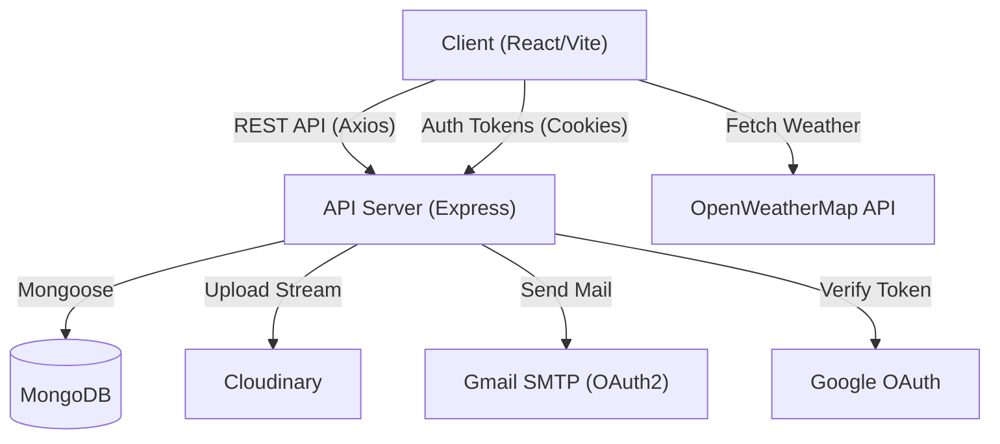
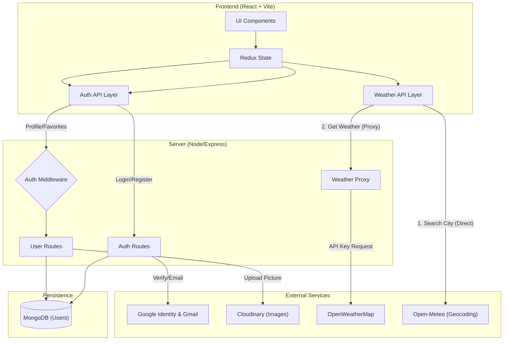

# WeatherPro - Advanced Weather Application

A modern, full-stack weather application providing real-time forecasts, 3D visualizations, and personalized account management. Built with the MERN stack and enhanced with premium UI/UX features.

## 🚀 Tech Stack

### Frontend

- **Framework:** React 18 + Vite (TypeScript)
- **State Management:** Redux Toolkit
- **Styling:** Tailwind CSS + Vanilla CSS (Custom Theming)
- **Animations:** Framer Motion
- **3D Graphics:** Three.js (@react-three/fiber, @react-three/drei)
- **Charts:** Recharts
- **Icons:** Lucide React

### Backend

- **Runtime:** Node.js
- **Framework:** Express.js
- **Database:** MongoDB (Mongoose ODM)
- **Authentication:** JWT (JSON Web Tokens) + Google OAuth2 (@react-oauth/google)
- **Email Service:** Nodemailer (OAuth2 via Gmail)
- **Image Storage:** Cloudinary
- **Security:** bcryptjs, helmet, cors, cookie-parser

## 🌟 Key Features

### 1. Advanced Weather Visualization

- **Real-time Data:** Fetches global weather data using OpenWeatherMap API.
- **3D Loading Scenes:** Immersive 3D environments (Three.js) that reflect the loading state.
- **Dynamic Theming:** "Sunny", "Rainy", "Cloudy", "Ocean", "Crimson" themes that adapt the entire UI.
- **Interactive Charts:** Visual hourly and daily temperature trends.

### 2. Robust Authentication & User Management

- **Secure Login/Register:** JWT-based auth with HTTP-Only cookies.
- **Google Login:** Seamless one-tap sign-in.
- **Password Reset:** Secure OTP-based password reset flow via Email (OAuth2).
- **Profile Management:** Update name, email (local users), and profile picture (Cloudinary).
- **Account Deletion:** Full account removal including data cleanup.

### 3. Personalized Experience

- **Favorites:** Save and manage favorite cities.
- **Unit Preferences:** Toggle between Celsius/Fahrenheit, m/s vs mph.
- **Responsive Design:** Fully optimized for Mobile, Tablet, and Desktop.

## 🏗️ System Architecture



## 🏗️ System Architecture



### 🔄 Data Flow Strategies

1.  **Hybrid Weather Fetching**:

    - **City Search**: The client hits **Open-Meteo** directly for latency-critical autocomplete. No valid API key is exposed as Open-Meteo is free.
    - **Weather Data**: The client requests sensitive data (Temperature, Forecast) via the **Node.js Proxy**. This hides the **OpenWeatherMap API Key** from the browser source code.

2.  **Secure Authentication**:
    - **JWT & Cookies**: Tokens are stored in `HttpOnly`, `Secure` cookies, making them inaccessible to JavaScript (preventing XSS attacks).
    - **Google OAuth**: Uses the "Authorization Code" flow. The client sends a Google ID token to the backend, which verifies it and issues a session cookie.

### 🗄️ Database Schema (User)

The `User` collection is the core of the persistence layer ("MongoDB").

| Field       | Type   | Description                                          |
| :---------- | :----- | :--------------------------------------------------- |
| `username`  | String | Display name (or full name for Google users).        |
| `email`     | String | Unique index. Primary identifier.                    |
| `password`  | String | Bcrypt hash (Sparse, not required for Google users). |
| `googleId`  | String | Unique Google Subject ID (Sparse).                   |
| `picture`   | String | URL to Cloudinary image or Google profile picture.   |
| `favorites` | Array  | List of city names pinned by the user.               |

## 📂 Project Structure

```bash
Weather-App/
├── client/                 # Frontend Application
│   ├── public/             # Static assets (favicon, default-avatar)
│   ├── src/
│   │   ├── api/            # API endpoints & config
│   │   ├── app/            # Redux store setup
│   │   ├── assets/         # Images & fonts
│   │   ├── components/     # Reusable UI components
│   │   │   ├── 3d/         # Three.js scenes
│   │   │   ├── layout/     # Navbar, Wrapper
│   │   │   ├── settings/   # Account, Theme, Prefs
│   │   │   └── weather/    # Weather cards, charts
│   │   ├── features/       # Redux slices (auth, weather)
│   │   ├── pages/          # Route components (Home, Settings)
│   │   └── utils/          # Helper functions
│   └── ...
│
├── server/                 # Backend API
│   ├── config/             # DB, Cloudinary, Env config
│   ├── controllers/        # Route logic
│   ├── middleware/         # Auth, Error, Upload middleware
│   ├── models/             # Mongoose schemas
│   ├── routes/             # API routes definition
│   └── ...
└── README.md
```

## 🛠️ Setup Instructions

### Prerequisites

- Node.js (v18+)
- MongoDB URI
- Cloudinary Keys
- Google OAuth Credentials
- OpenWeatherMap API Key

### Environment Variables (.env)

**Server (.env)**

```env
PORT=5000
MONGO_URI=your_mongo_connection_string
JWT_SECRET=your_jwt_secret
NODE_ENV=development
CLIENT_URL=http://localhost:5173

# Email (OAuth2)
EMAIL_USER=your_email@gmail.com
GOOGLE_CLIENT_ID=...
GOOGLE_CLIENT_SECRET=...
GOOGLE_REFRESH_TOKEN=...
GOOGLE_REDIRECT_URI=https://developers.google.com/oauthplayground

# WeatherAPI
WEATHER_API_KEY=...
WEATHER_BASE_URL=https://api.openweathermap.org/data/2.5
WEATHER_GEO_URL=http://api.openweathermap.org/geo/1.0

# Cloudinary
CLOUDINARY_CLOUD_NAME=...
CLOUDINARY_API_KEY=...
CLOUDINARY_API_SECRET=...
```

**Client (.env)**

```env
VITE_GOOGLE_CLIENT_ID=your_google_client_id
VITE_LOCAL_URL=http://localhost:5000 # Optional/Dev
VITE_SERVER_URL=server_url
```

### Installation

1.  **Install Client Dependencies:**

    ```bash
    cd client
    npm install
    ```

2.  **Install Server Dependencies:**

    ```bash
    cd server
    npm install
    ```

3.  **Run Development Servers:**
    - **Client:** `npm run dev` (Port 5173)
    - **Server:** `npm run dev` (Port 5000)

## 🤝 Contributing

Feel free to open issues or submit pull requests for improvements.

## 📄 License

MIT
