# UML Documentation

## 🏗️ Class Diagram

This diagram represents the core data structures used in both the Client (interfaces) and Server (Mongoose schema).

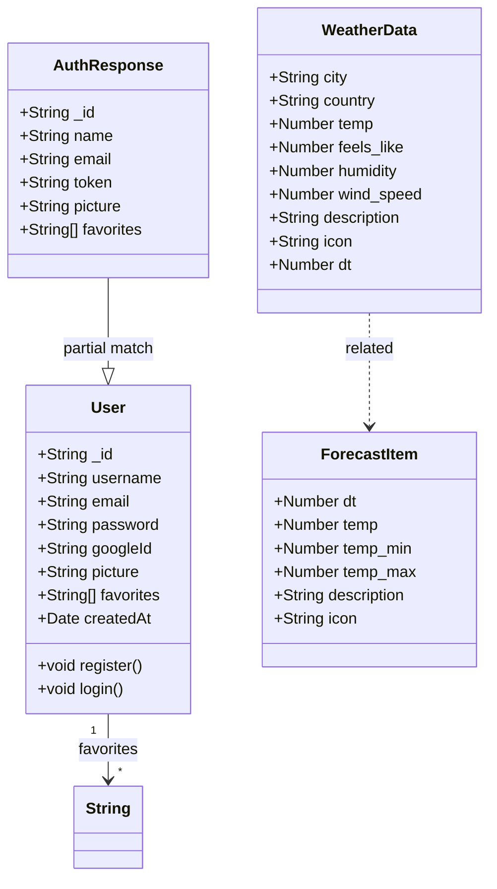

## 🧩 Component Diagram

This diagram visualizes the React component hierarchy, showing how the application is structured from the root `App` down to individual widgets.

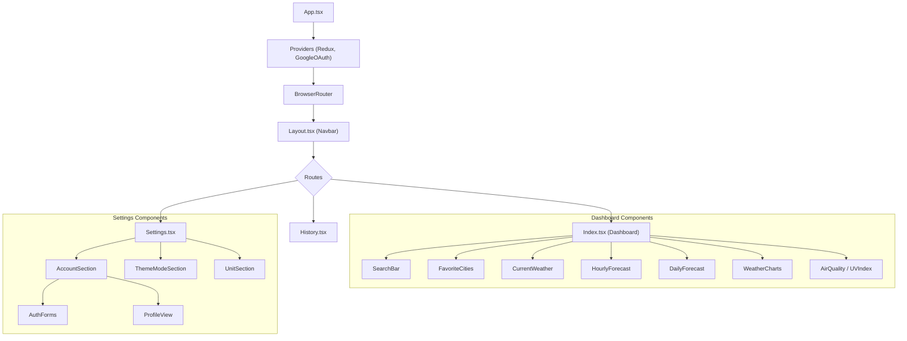

## 🚀 Deployment Diagram

This diagram shows the physical deployment architecture of the application services and their interactions with external cloud providers.

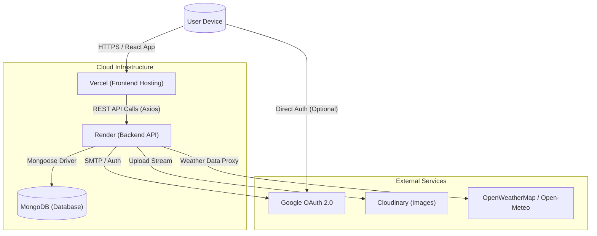

## 📦 Object Diagram

This diagram shows a specific runtime instance of the application entities, illustrating how a `User` typically relates to their `Auth` session and cached `WeatherData` at a moment in time (e.g., after logging in and viewing "London").

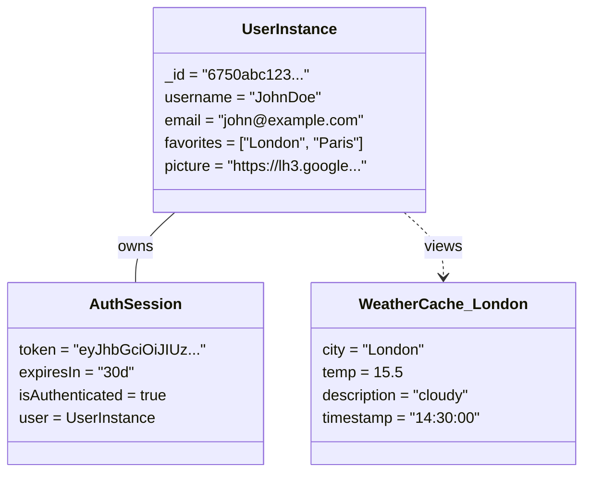

## 📚 Package Diagram

This diagram organizes the system elements into logical groupings (packages/namespaces) to show specific dependencies between high-level modules in the application architecture.

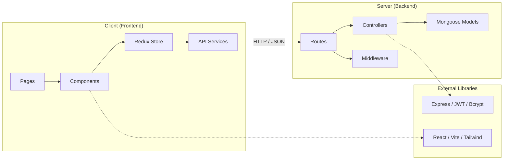

## 🏷️ Profile Diagram

The Profile Diagram defines custom stereotypes used throughout the architecture, extending standard UML elements to fit the React/Express domain.

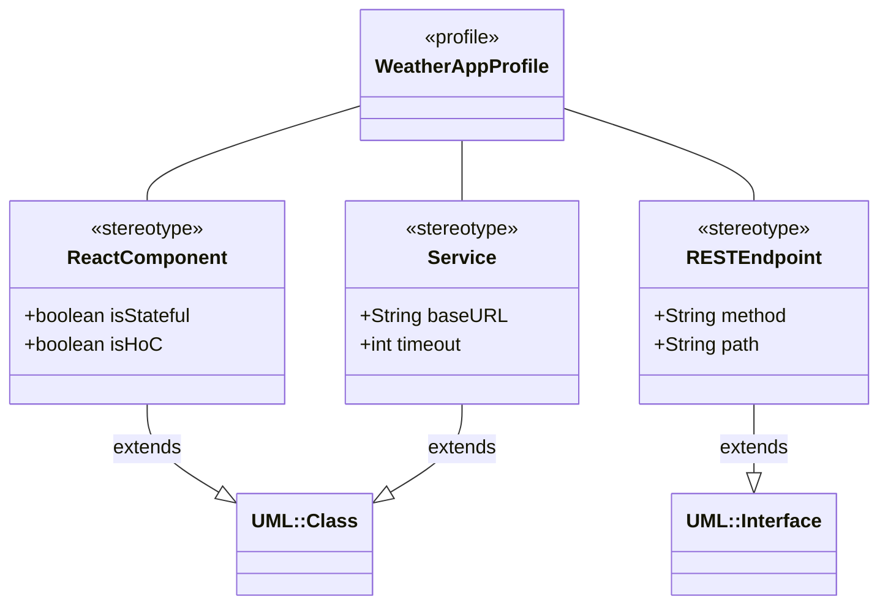

## 🧱 Composite Structure Diagram

This diagram details the internal structure of the main `WeatherDashboard` page (the `Index` component), illustrating how it connects to the Redux Store port and manages its internal parts (widgets).

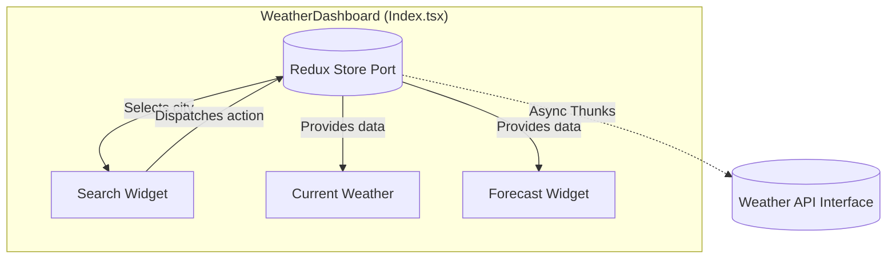

## 👤 Use Case Diagram

This diagram identifies the different types of users (Actors) and their possible interactions (Use Cases) with the Weather App system.

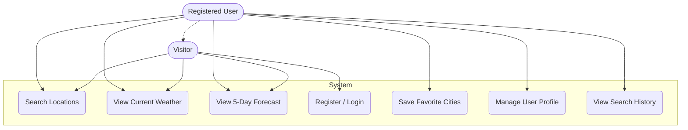

## 🏃 Activity Diagram

### User Search Flow

This diagram illustrates the step-by-step workflow for a typical user session: searching for a city and viewing details, with an optional login branch.

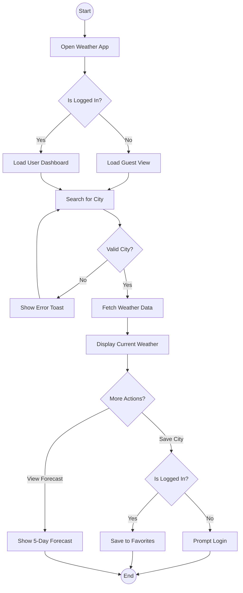

### User Registration Flow

This diagram details the user registration, validation, and auto-login process.

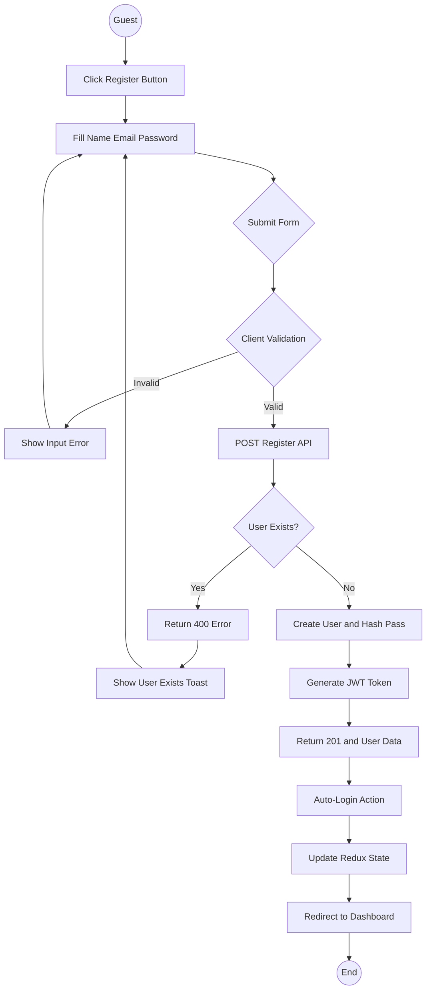

## 🔄 State Machine Diagram

This diagram models the life cycle of the "Weather Data Fetching" process, illustrating how the UI transitions between Idle, Loading, Success, and Error states based on user actions and API responses.

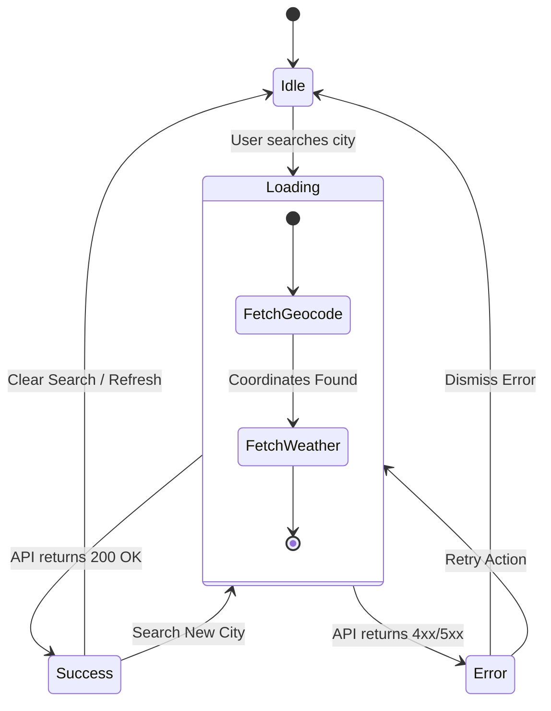

## ⏱️ Sequence Diagram

### Weather Search Flow

This diagram details the time-ordered interactions between the System Actors (User, Client) and the Backend Services (Server, Database, External APIs) during a full "Weather Search" operation.

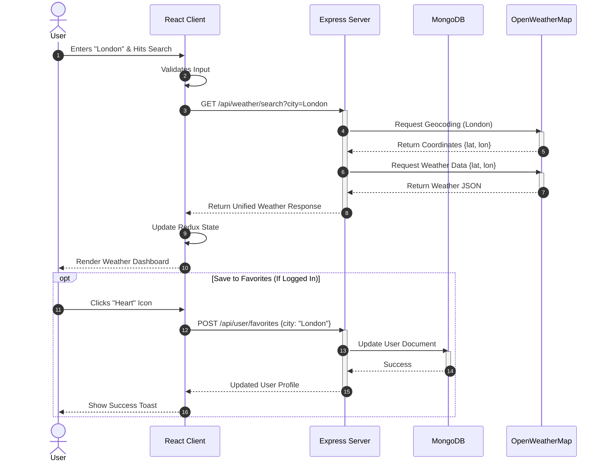

### Forgot Password Flow

This diagram details the flow for resetting a forgotten password via email OTP.

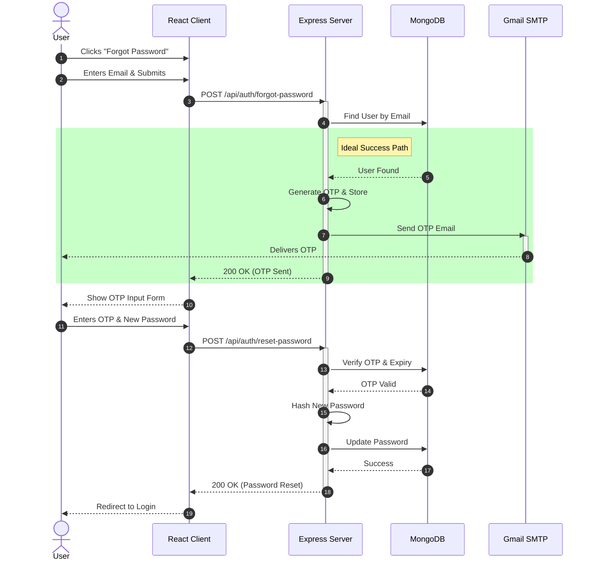

## 📡 Communication Diagram

This diagram simulates a Communication Diagram (Collaboration Diagram) illustrating the structural relationships and message flow for the **User Login** process. The numbered edges correspond to the order of operations.

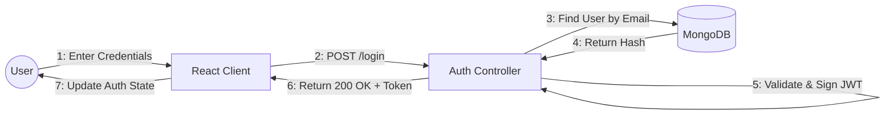

## 🧭 Interaction Overview Diagram

This diagram provides a high-level view of the control flow between different interaction sequences, linking the Login, Search, and Logout behaviors.

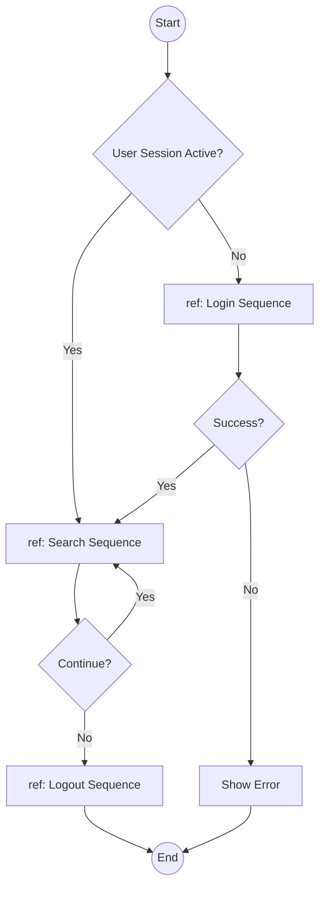

## ⏲️ Timing Diagram (Gantt)

This diagram visualizes the critical timing of the "Search Debounce & API Request" flow, showing how character input events trigger a debounce timer before the actual network request is sent.

```mermaid
gantt
    title Search Debounce & API Latency (500ms Debounce)
    dateFormat x
    axisFormat %Lms

    section User Input
    Type L       : 0, 100
    Type o       : 100, 200
    Type n       : 200, 300

    section Debounce
    Timer Active : 0, 300
    Trigger Wait : active, 300, 800

    section Network
    API Request  : 800, 1500
    Update UI    : 1500, 1600
```
