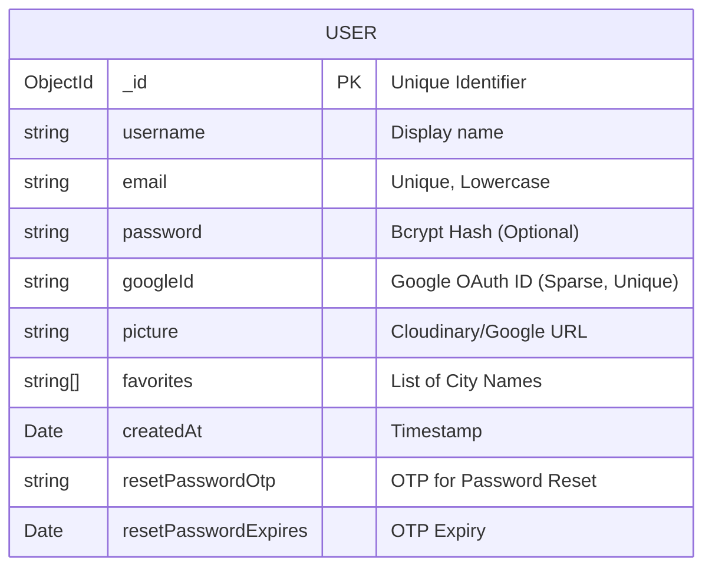

# Database Documentation

**Database Engine**: MongoDB (NoSQL)
**ODM**: Mongoose

## 📊 ER Diagram

Since MongoDB is document-based, this diagram represents the structure of the `User` collection.



## 📂 Collections

### 1. `users`

Stores all account information for the application.

- **Primary Key**: `_id` (Auto-generated ObjectId)
- **Indexes**:
  - `email` (Unique): Ensures no duplicate accounts with the same email.
  - `googleId` (Unique, Sparse): Ensures one account per Google ID, but allows multiple users to _not_ have one (i.e., local users).

#### Schema Reference

| Field                  | Type          | Required | Description                                  |
| :--------------------- | :------------ | :------- | :------------------------------------------- |
| `username`             | String        | Yes      | User's display name.                         |
| `email`                | String        | Yes      | Contact email. Used for login.               |
| `password`             | String        | No       | Hashed password. Null for Google-only users. |
| `googleId`             | String        | No       | ID from Google OAuth.                        |
| `picture`              | String        | No       | URL to profile image (Cloudinary or Google). |
| `name`                 | String        | No       | Full name (often same as username).          |
| `preferences`          | Object        | No       | User settings (Future scope: units, theme).  |
| `favorites`            | Array<String> | No       | List of city names pinned by the user.       |
| `resetPasswordOtp`     | String        | No       | 6-digit OTP for password recovery.           |
| `resetPasswordExpires` | Date          | No       | Expiration time for validity of OTP.         |
| `createdAt`            | Date          | No       | Account creation timestamp (Default: `now`). |

---

## 🌱 Example Seed Data

You can use this JSON to seed your local database for testing purposes.

```json
[
  {
    "username": "DemoUser",
    "email": "demo@example.com",
    "password": "$2a$10$X7...",
    "favorites": ["New York", "London", "Tokyo"],
    "createdAt": "2024-01-01T12:00:00.000Z",
    "picture": "https://api.dicebear.com/7.x/avataaars/svg?seed=Demo"
  },
  {
    "username": "GoogleUser",
    "email": "user@gmail.com",
    "googleId": "1029384756",
    "favorites": ["Paris"],
    "createdAt": "2024-02-15T08:30:00.000Z",
    "picture": "https://lh3.googleusercontent.com/..."
  }
]
```

## 🔗 Relations

- **NoSQL Design**: This application currently uses a single-collection architecture.
- **Future Scope**: If we add `reviews` or `weathers` history, they would likely reference `_id` from the `users` collection.
