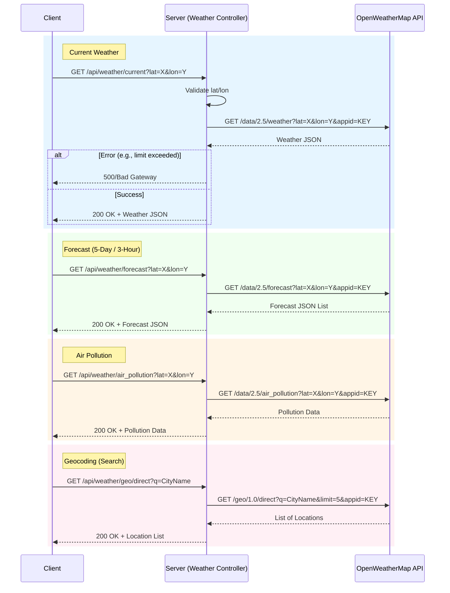

# API Flow Documentation

This document outlines the architecture and data flow of the Weather App's API, focusing on how the backend serves as a proxy for external services (OpenWeatherMap) and manages internal resources.

## Weather API Flow (Sequence Diagram)

The Server acts as a proxy to hide API keys and handle errors before forwarding data to the Client.

## API Endpoints Overview

### Weather (`/api/weather`)

These endpoints proxy requests to OpenWeatherMap.

| Endpoint         | Method | Params                     | Description                                         |
| :--------------- | :----- | :------------------------- | :-------------------------------------------------- |
| `/current`       | GET    | `lat`, `lon`, `q`, `units` | Fetches current weather conditions.                 |
| `/forecast`      | GET    | `lat`, `lon`, `units`      | Fetches 5-day forecast data with 3-hour steps.      |
| `/air_pollution` | GET    | `lat`, `lon`               | Fetches air pollution data (CO, NO, NO2, O3, etc.). |
| `/geo/direct`    | GET    | `q`, `limit`               | Searches for city coordinates by name.              |

### Auth (`/api/auth`)

_See [Data Flow Documentation](data_flow_documentation.md) for detailed auth flows._

| Endpoint           | Method | Description                          |
| :----------------- | :----- | :----------------------------------- |
| `/register`        | POST   | Register a new user.                 |
| `/login`           | POST   | Login with email/password.           |
| `/google`          | POST   | Login/Register with Google ID Token. |
| `/logout`          | POST   | Clear auth cookie.                   |
| `/forgot-password` | POST   | Request OTP email.                   |
| `/reset-password`  | POST   | Reset password with OTP.             |
