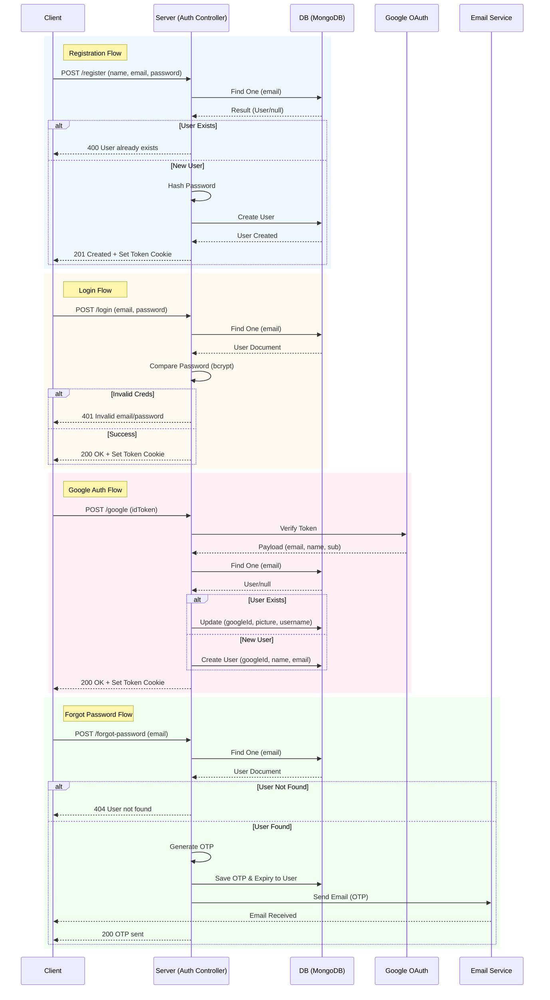

# Data Flow Documentation

This document outlines the data flow for key processes within the Weather App, specifically focusing on User Authentication and Management.

## Authentication Flow (Sequence Diagram)

The following sequence diagram illustrates the step-by-step interactions between the Client, Server, Database, and External Services for Registration, Login, Google Auth, and Password Reset.

## Flow Details

#### 1. User Registration

**Endpoint**: `/api/auth/register`

1.  **Incoming Data**: Client sends `name`, `email`, `password`, and optional `username`.
2.  **Validation**: Server checks if `email` already exists in MongoDB.
3.  **Processing**:
    - Password is hashed using `bcryptjs`.
    - If `username` is missing, it is generated from `name` or `email` prefix.
4.  **Storage**: New document created in `User` collection.
5.  **Response**: Returns User JSON and sets HTTP-only `token` cookie.

#### 2. User Login

**Endpoint**: `/api/auth/login`

1.  **Incoming Data**: `email`, `password`.
2.  **Verification**: Look up user by `email`. If found, compare `password` hash.
3.  **Response**:
    - **Success**: Returns User JSON (excluding password) and sets `token` cookie.
    - **Failure**: Returns 401 Unauthorized.

#### 3. Google OAuth

**Endpoint**: `/api/auth/google`

1.  **Incoming Data**: Google `idToken`.
2.  **Verification**: Token verified against `GOOGLE_CLIENT_ID` via `google-auth-library`.
3.  **Synchronisation**:
    - Extracts `googleId` (`sub`), `email`, `name`, `picture`.
    - **Existing User**: Updates `googleId`, `picture` (if missing), and backfills `username` if missing.
    - **New User**: Creates account with verified data and generated `username`.
4.  **Response**: Returns User JSON and sets `token` cookie.

#### 4. Password Reset

**Phase 1: Request OTP (`/api/auth/forgot-password`)**

- Input: `email`.
- Effect: Generates 6-digit OTP, saves to `User.resetPasswordOtp` with 10m expiry. Sends email via Nodemailer.

**Phase 2: Reset (`/api/auth/reset-password`)**

- Input: `email`, `otp`, `newPassword`.
- Validation: Finds user matching `email` AND `otp` AND unexpired validity.
- Action: Hashes `newPassword`, clears OTP fields, updates `password`.
